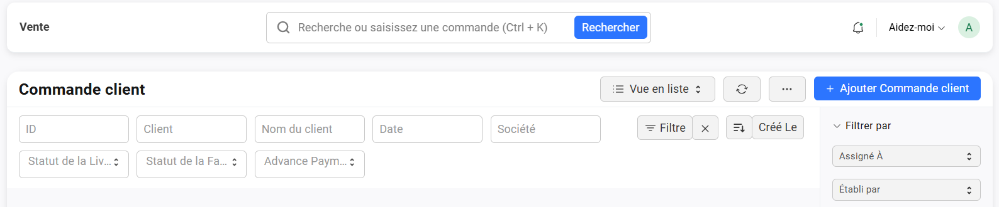

# 📦 Créer une commande client

> La création d’une commande formalise l’engagement de vente suite à un devis accepté ou à une demande directe du client.

---

## 🎯 Objectif

Ce tutoriel vous guide pas à pas pour **créer**, **enregistrer** et **confirmer** une commande client dans LEO.

---

## 🪜 Étapes de création

### 1. Accéder au module **Commandes**

- Depuis l'**onglet principal** : Ventes > Commandes

{.shadowed-image}

- Cliquez sur **➕ Ajouter commande client** (en haut à droite) ou créez-la depuis un **devis accepté** via l’action « Convertir en commande ».

{.shadowed-image}

---

### 2. Remplir les informations générales

- Dans l'onglet **📝 Détails** de la commande :

| Champ                      | Description                                                                                         |
|----------------------------|-----------------------------------------------------------------------------------------------------|
| **👤 Client**             | Sélectionnez un client existant ou créez-en un **[nouveau](../gestion-ventes/clients/fiche.md)**.    |
| **📅 Date de commande**   | Date de création du document.                                                                        |
| **📅 Date de livraison**   | Date de livraison.                                                                                  |
| **📅 N° de la Commande d'Achat du Client**   | Numéron du bon de commande du client (sur ce dernier).             |

> ⚠️ **Champs obligatoires** : Le client et la date de commande doivent impérativement être renseignés.

---

### 3. Ajouter les lignes de produits

- Cliquez sur **Ajouter une ligne**.
- Sélectionnez l’**article** ou le **service**.
- Renseignez la **quantité**, vérifiez le **prix unitaire**, appliquez une **remise** si nécessaire.
- Le système calcule automatiquement le **total HT/TTC**.

> ⚠️ **Champs obligatoires** : Le nom de l'article, la quantité ainsi que l'unité de mesure doivent impérativement être renseignés.

{.shadowed-image}

> 💡 **Astuce** : vous pouvez utiliser une douchette pour scanner un article. Il vous suffira ensuite d’ajouter la quantité.

---

#### ⚙️ Modale unité de mesure à l’ajout d’un article

Lors de l’ajout d’un article dans une commande, **si l’article dispose de plusieurs unités de mesure (UDM)**, une **fenêtre modale** apparaît automatiquement.

***Fonctionnalités de la modale :***

- **Choix de l’unité** :  
  Sélectionnez l’unité de mesure souhaitée parmi celles disponibles pour cet article (ex. : pièce, boîte, kilogramme, litre).

- **Conversion automatique** :  
  La quantité saisie est automatiquement convertie selon l’unité choisie, garantissant la cohérence des quantités et prix.

- **Affichage clair** :  
  La modale affiche les différentes unités disponibles avec leurs équivalences, facilitant la sélection.

{.shadowed-image}

> 💡 **Astuce** : Cette fonctionnalité permet d’adapter précisément les quantités aux besoins du client et à la gestion des stocks.

---

#### ⚙️ Modale des articles associés

Lorsqu’un article dispose d’**articles liés** (accessoires, options, pièces complémentaires…), une **fenêtre modale** s’affiche automatiquement lors de son ajout à la commande.

***Fonctionnalités de la modale :***

- **Affichage des articles liés**  
  Une liste claire présente les articles associés avec leur **description**, **quantité par défaut** et **prix**.

- **Sélection personnalisée**  
  Vous choisissez les articles à ajouter à la commande, et pouvez **ajuster les quantités** selon les besoins du client.

- **Gestion des dépendances**  
  Certains articles associés peuvent être **obligatoires** (ajout automatique) ou **optionnels**, selon la **règle métier** définie.

- **Mise à jour automatique**  
  Une fois sélectionnés, les articles associés sont **intégrés directement** dans la commande, avec **recalcul automatique** des totaux (HT/TTC, remises, etc.).

{.shadowed-image}

> 💡 **Astuce** : Permet de définir quels sont les articles **liés** ou à **retourner** automatiquement selon le type de produit sélectionné.

---

### 4. Conditions de vente (facultatif)

- **Modalités de paiement** (ex. : 30 jours fin de mois)
- **Frais de livraison**
- **Commentaires** affichés sur le PDF client

---

### 5. Sauvegarder et confirmer

1. Cliquez sur **Enregistrer** pour sauvegarder le brouillon.  
2. Cliquez sur **Générer le PDF** pour prévisualiser le bon de commande.  
3. Cliquez sur **Confirmer la commande** pour engager la préparation.

---

## ✅ Résultat attendu

- La commande apparaît dans la liste avec un **statut** : Brouillon / Confirmée / En préparation / Facturée.
- Elle est automatiquement **rattachée** à la fiche du client.
- Un **PDF téléchargeable** est généré.

---

## 🗂️ Détail des onglets de la Commande

Le formulaire est divisé en **4 onglets** pour faciliter la saisie et la lecture.

| Onglet                      | Description                                                                                |
|-----------------------------|--------------------------------------------------------------------------------------------|
| **📝 Détails**             | Informations principales de la commande : client, date, produits, quantités, prix.         |
| **📍 Adresse et contact**  | Coordonnées de facturation et de livraison, contacts associés au client.                   |
| **ℹ️ Plus d’infos**        | Informations complémentaires internes : références, notes, tags.                           |
| **📄 Termes**              | Conditions commerciales : paiements, remises, frais, clauses contractuelles.               |

---

### 📝 Détails

Contient les **informations principales** de la commande.

| Champ                        | Description                                                        |
|------------------------------|--------------------------------------------------------------------|
| **📦 Articles**              | Produits/services commandés (quantité, prix, client).              |
| **💸 Taxes et frais**        | Gère les éléments qui impactent le montant final de la commande.   |
| **💸 Remise supplémentaire** | Gère les remises supplémentaires.                                   |

> 💡 **Astuce** : Ajoutez des remises ligne par ligne, ou appliquez une remise globale dans l’onglet "Termes".

#### 💸 Taxes et frais

Dans cette partie, vous pouvez gérer les taxes et frais applicables à la commande.

- **Catégorie de taxe**  
  Sélectionnez la catégorie de taxe applicable.

- **Modèle de Taxes et Frais**  
  Modèle préconfiguré appliqué automatiquement aux ventes.

- **Règle de Livraison**  
  Règle logistique associée à la livraison.

- **Incoterm**  
  Clause Incoterm définissant les responsabilités liées au transport et à la livraison.

{.shadowed-image}

> ⚠️ **Important** : Veillez à vérifier que les taux et frais appliqués sont conformes à la réglementation en vigueur.

#### 💸 Remise Supplémentaire

Cette section permet d’appliquer une remise supplémentaire à la commande.

- **Appliquer une remise sur**  
  Sélectionnez la base de calcul de la remise (ex. : Total TTC).

- **Code de coupon**  
  Saisissez un code promo pour appliquer une réduction spécifique (facultatif).

- **Pourcentage de remise**  
  Pourcentage à appliquer en réduction supplémentaire sur la base sélectionnée.

- **Montant de la remise (EUR)**  
  Montant fixe de réduction appliqué, remplace ou complète le pourcentage selon configuration.
