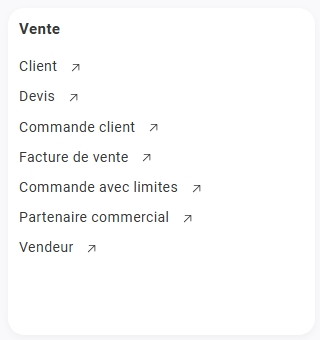
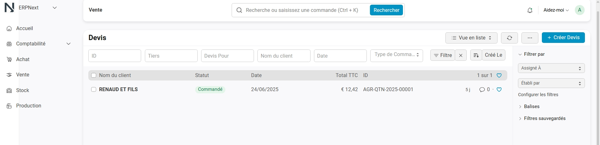
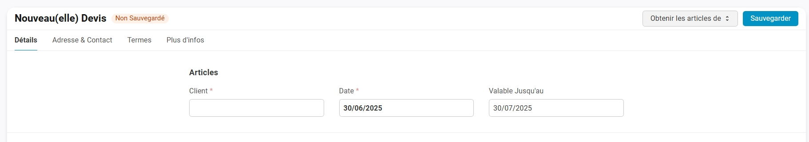
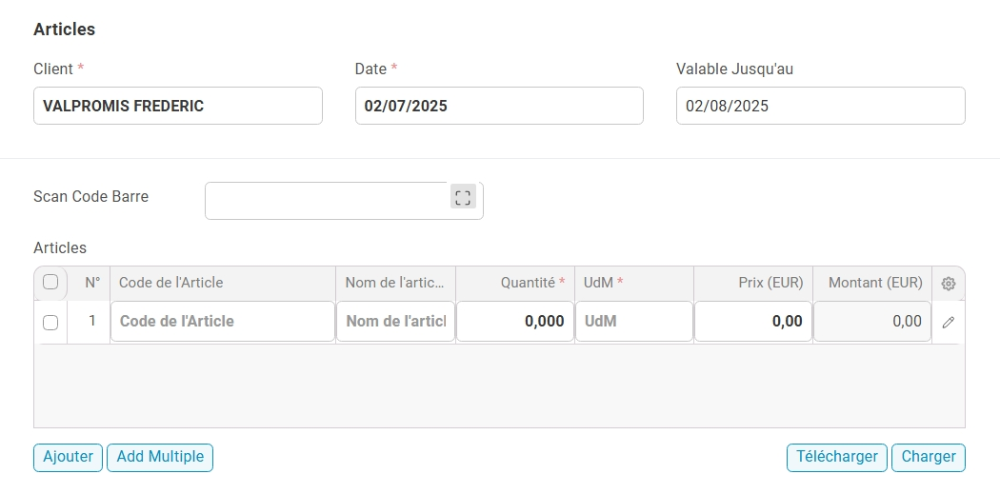
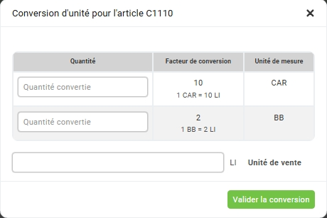
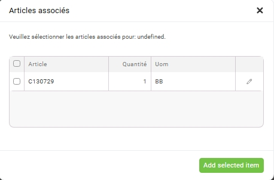
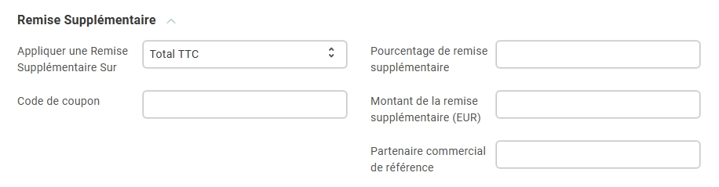
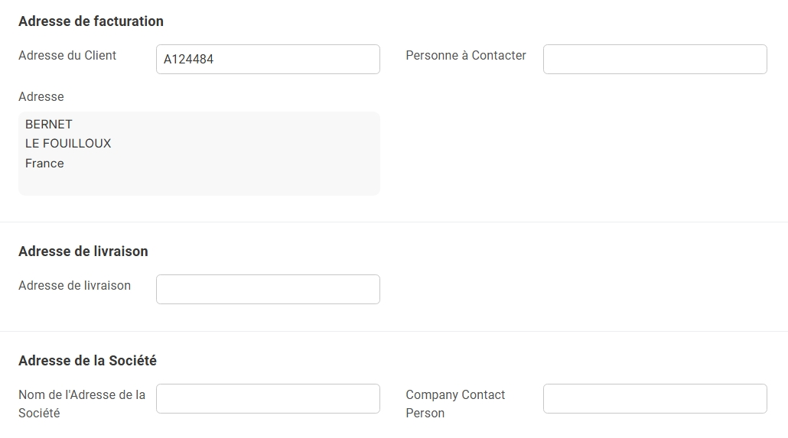
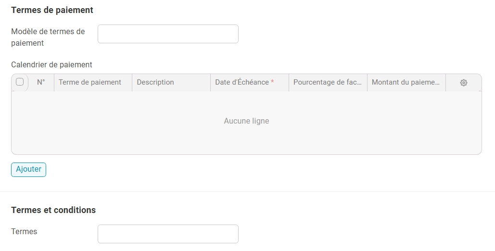

# 📝 Créer un devis dans NEXT

> La création d’un devis est une étape essentielle du processus de vente.  
> Elle permet de formuler une offre chiffrée à un client potentiel, avec un détail précis des produits, quantités, prix et conditions commerciales.

---

## 🎯 Objectif

Ce tutoriel vous guide pas à pas pour **créer**, **enregistrer** et **envoyer** un devis à un client depuis l’interface de NEXT.

---

## 🪜 Étapes de création

### 1. Accéder au module **Devis**

- Depuis l'**onglet principal** : Ventes > Devis

{.shadowed-image}

- Cliquez sur le bouton **➕ Créer devis** (en haut à droite).

{.shadowed-image}

---

### 2. Remplir les informations générales

- Dans l'onglet **📝 Détails** du nouveau devis :

| Champ                  | Description                                                                                       |
|------------------------|---------------------------------------------------------------------------------------------------|
| **👤 Client**         | Sélectionnez un client existant ou créez-en un **[nouveau](../gestion-ventes/clients/fiche.md)**. |
| **📅 Date du devis**  | Date de création du document.                                                                     |
| **⏳ Validité**       | Durée de validité de l’offre (ex. : 30 jours).                                                    |

{.shadowed-image}

> ⚠️ **Champs obligatoires** : Le client et la date du devis doivent impérativement être renseignés.

---

### 3. Ajouter les lignes de produits

- Cliquez sur **Ajouter une ligne**.
- Sélectionnez l’**article** ou le **service**.
- Renseignez la **quantité**, vérifiez le **prix unitaire**, appliquez une **remise** si nécessaire.
- Le système calcule automatiquement le **total HT/TTC**.

> ⚠️ **Champs obligatoires** : Le nom de l'article, la quantité ainsi que l'unité de mesure doivent impérativement être renseignés.

{.shadowed-image}

> 💡 **Astuce** : vous pouvez utiliser une douchette pour scanner un article. Il vous suffira ensuite d’ajouter la quantité.

---

#### ⚙️ Modale unité de mesure à l’ajout d’un article

Lors de l’ajout d’un article dans un devis ou une commande, **si l’article dispose de plusieurs unités de mesure (UDM)**, une **fenêtre modale** apparaît automatiquement.

***Fonctionnalités de la modale :***

- **Choix de l’unité** :  
  Sélectionnez l’unité de mesure souhaitée parmi celles disponibles pour cet article (ex. : pièce, boîte, kilogramme, litre).

- **Conversion automatique** :  
  La quantité saisie est automatiquement convertie selon l’unité choisie, garantissant la cohérence des quantités et prix.

- **Affichage clair** :  
  La modale affiche les différentes unités disponibles avec leurs équivalences, facilitant la sélection.

{.shadowed-image}

> 💡 Cette fonctionnalité permet d’adapter précisément les quantités aux besoins du client et à la gestion des stocks.

---

#### ⚙️ Modale des articles associés

Lorsqu’un article dispose d’**articles liés** (accessoires, options, pièces complémentaires…), une **fenêtre modale** s’affiche automatiquement lors de son ajout au devis.

***Fonctionnalités de la modale :***

- **Affichage des articles liés**  
  Une liste claire présente les articles associés avec leur **description**, **quantité par défaut** et **prix**.

- **Sélection personnalisée**  
  Vous choisissez les articles à ajouter au devis, et pouvez **ajuster les quantités** selon les besoins du client.

- **Gestion des dépendances**  
  Certains articles associés peuvent être **obligatoires** (ajout automatique) ou **optionnels**, selon la **règle métier** définie.

- **Mise à jour automatique**  
  Une fois sélectionnés, les articles associés sont **intégrés directement** dans le devis, avec **recalcul automatique** des totaux (HT/TTC, remises, etc.).

{.shadowed-image}

> 💡 **Astuce** : Permet de définir quels sont les articles **liés** ou à **retourner** automatiquement selon le type de produit sélectionné.

---

### 4. Conditions de vente (facultatif)

- **Modalités de paiement** (ex. : 30 jours fin de mois)
- **Frais de livraison**
- **Commentaires** affichés sur le PDF client

---

### 5. Sauvegarder et envoyer

1. Cliquez sur **Enregistrer** pour sauvegarder le brouillon.  
2. Cliquez sur **Générer le PDF** pour prévisualiser le devis.  
3. Cliquez sur **Envoyer par email** pour transmettre au **[client](../gestion-ventes/clients/fiche.md)**.

---

## ✅ Résultat attendu

- Le devis est visible dans la liste avec un **statut** : Brouillon / Envoyé / Accepté / Refusé.
- Il est automatiquement **rattaché** à la fiche du client.
- Un **PDF téléchargeable** est généré.

---

## 🗂️ Détail des onglets du Devis

Le formulaire est divisé en **4 onglets** pour faciliter la saisie et la lecture.

| Onglet                      | Description                                                                              |
|-----------------------------|------------------------------------------------------------------------------------------|
| **📝 Détails**             | Informations principales du devis : client, date, validité, produits, quantités, prix.   |
| **📍 Adresse et contact**  | Coordonnées de facturation et de livraison, contacts associés au client.                 |
| **ℹ️ Plus d’infos**        | Informations complémentaires internes : références, notes, tags.                         |
| **📄 Termes**              | Conditions commerciales : paiements, remises, frais, clauses contractuelles.             |

---

### 📝 Détails

Contient les **informations principales** du devis.

| Champ                    | Description                                                        |
|--------------------------|--------------------------------------------------------------------|
| **📦 Articles** | Produits/services proposés (quantité, prix, client).                       |
| **💸 Taxes et frais**     | Gére les éléments qui impactent le montant final du devis  .     |
| **💸 Remise supplémentaire**     | Gére les remises supplémentaires.                          |

> 💡 **Astuce** : Ajoutez des remises ligne par ligne, ou appliquez une remise globale dans l’onglet "Termes".

#### 💸 Taxes et frais

Dans cette partie, vous pouvez gérer les taxes et frais applicables au devis.

- **Catégorie de taxe**  
  Sélectionnez la catégorie de taxe applicable.

- **Modèle de Taxes et Frais**  
  Modèle préconfiguré appliqué automatiquement aux ventes.

- **Règle de Livraison**  
  Règle logistique associée à la livraison.

- **Incoterm**  
  Clause Incoterm définissant les responsabilités liées au transport et à la livraison.

{.shadowed-image}

> ⚠️ **Important** : Veillez à vérifier que les taux et frais appliqués sont conformes à la réglementation en vigueur pour éviter tout litige.

#### 💸 Remise Supplémentaire

Cette section permet d’appliquer une remise supplémentaire au devis.

- **Appliquer une remise sur**  
  Sélectionnez la base de calcul de la remise (ex. : Total TTC).

- **Code de coupon**  
  Saisissez un code promo pour appliquer une réduction spécifique (facultatif).

- **Pourcentage de remise**  
  Pourcentage à appliquer en réduction supplémentaire sur la base sélectionnée.

- **Montant de la remise (EUR)**  
  Montant fixe de réduction appliqué, remplace ou complète le pourcentage selon configuration.

- **Partenaire commercial**  
  Référence éventuelle au partenaire lié à cette remise.

{.shadowed-image}

> 💡 **Astuce** : Utilisez cette remise pour offrir des promotions ponctuelles ou spécifiques, et suivre les remises par partenaire.

---

### 📍 Adresse et contact

Regroupe les **coordonnées** du client.

| Champ                        | Description                                                                |
|------------------------------|----------------------------------------------------------------------------|
| **🏠 Adresse de facturation** | Automatiquement renseignée selon la fiche client (modifiable).            |
| **🚚 Adresse de livraison**   | Peut être différente de l’adresse de facturation.                         |
| **📞 Contact principal**      | Personne référente à contacter (nom, téléphone, email).                   |

{.shadowed-image}

> 📌 Le contact défini ici recevra l’email contenant le devis.

---

### 📄 Termes

Spécifie les **conditions commerciales**.

| Champ                         | Description                                                                 |
|-------------------------------|-----------------------------------------------------------------------------|
| **💳 Modalités de paiement**   | Exemple : 30 jours fin de mois, comptant, à réception.                     |
| **📆 Calendrier de paiements** | Affiche les différentes échéances de règlement.                            |
| **📝 Description des termes**  | Précisions contractuelles ou clauses spécifiques visibles sur le PDF.      |

{.shadowed-image}

> ✨ **Conseil** : Renseignez les termes pour sécuriser la compréhension commerciale avec le client.

---

### ℹ️ Plus d’infos

Section réservée aux données **internes**.

| Champ                           | Description                                                                    |
|---------------------------------|--------------------------------------------------------------------------------|
| **🖨️ Paramètres d'impression** | Permet de choisir un modèle ou un format spécifique lors de l'impression.      |
| **🛑 Raison perdu**            | Motifs internes expliquant pourquoi le devis n’a pas abouti à une vente.       |
| **📌 Infos complementaire**    | Données de suivi comme le statut, la région, ou la source du devis fournisseur.|

---

## 🔄 Étapes suivantes

Une fois le devis accepté :

- Le convertir en **commande client**
- Poursuivre le cycle : **livraison → facturation → paiement**
