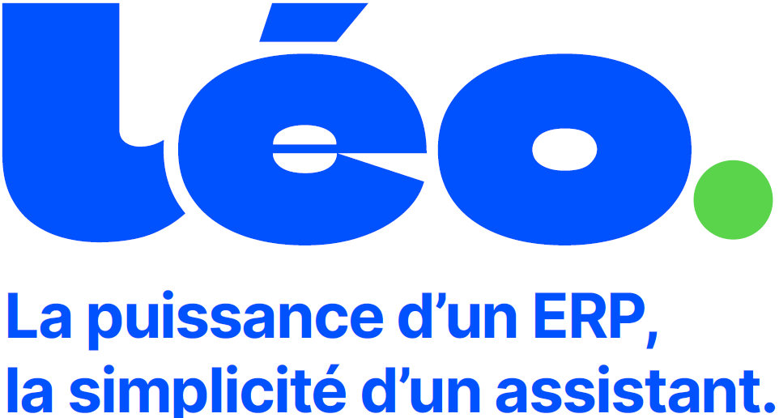

  

<h1 align="center"><strong>Manuel Utilisateur</strong></h1>

<em>Innover. Conseiller. Agir.</em>

---

Bienvenue dans **LEO**, la solution ERP conçue pour accompagner la croissance et la transformation de votre entreprise.  
NEXT vous aide à **structurer**, **piloter** et **optimiser** vos activités, tout en favorisant la **collaboration** et l’**efficacité** au quotidien.

> *« Grandir ensemble en bâtissant de nouveaux espaces plus spacieux, plus coopératifs, plus beaux ! »*

---

## 🌾 Une solution ERP adaptée au négoce — **LANDREAU GROUPE**

La mise en place de **LEO** permet à **LANDREAU GROUPE** de **digitaliser** ses processus métier.  
L’objectif est de mécaniser au maximum les tâches répétitives et de tirer pleinement parti des technologies numériques adaptées à notre activité, afin de rester **compétitifs** et **agiles** face aux évolutions du marché.

> 💡 **LEO** est une réponse concrète aux enjeux actuels de **productivité**, de **qualité de service** et de **traçabilité**.

---

## 📖 À propos de ce manuel

Ce guide utilisateur présente les **principales fonctionnalités** de la solution **LEO**, développée **pour et par** **LANDREAU GROUPE**.  

Il s’adresse à l’ensemble des collaborateurs et fournit toutes les informations nécessaires pour une **prise en main rapide** et une **utilisation optimale** de l’ERP.

> Ce guide regroupe l’ensemble des bonnes pratiques, règles métier et instructions fonctionnelles nécessaires pour utiliser efficacement LEO.

---
